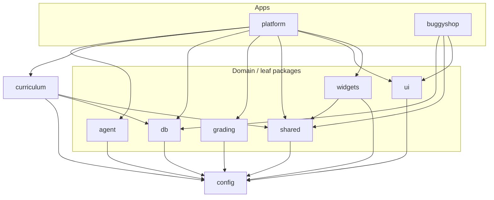

# Architecture

QA Mastery is a hands-on QA learning platform. Two Next.js apps share a Supabase
(Postgres + Auth + Storage) backend through a set of internal packages, deployed
on Vercel. This doc is the system overview; `CLAUDE.md` holds the engineering
conventions + invariants, and `DEPLOYMENT.md` the go-live steps.

## System context

- **platform** (`:3000`) — the learner-facing app: lessons, interactive widgets,
  graded quizzes/labs/capstone, dashboard/XP, the help-agent tutor, code labs.
- **buggyshop** (`:3001`) — a deliberately-buggy practice e-commerce app the
  curriculum tests against. Fake (cookie-free) auth; every bug is seeded behind
  a release flag.
- **Supabase** — Postgres (RLS), Auth, Storage. One client per request;
  `auth.getUser()` for the real boundary; a service-role client bypasses RLS for
  server-side writes.
- **LLM** — the tutor resolves a provider free-first (Ollama → Gemini → Groq);
  paid (xAI/OpenAI) is opt-in only.

## Package dependency graph

A strict DAG — apps consume packages, packages never depend on apps or on each
other cyclically, and `config` is the universal leaf.

| Layer | Packages | Role |
|---|---|---|
| 3 — apps | `platform`, `buggyshop` | Next.js App Router; consume packages only |
| 2 — composite | `curriculum` (MDX→registry), `widgets` (teaching UI) | depend on `shared`/`db` |
| 1 — domain | `agent` (tutor LLM), `grading`, `db`, `ui`, `shared` | depend on `config` |
| 0 — leaf | `config` (tsconfig/eslint) | nothing |

**Pattern:** modular monolith on a shared Postgres — right for a small team +
rapid iteration. Internal packages ship TS source; apps list them in
`transpilePackages`. Runtime-heavy/server-only code is fenced behind subpath
exports (`@qa-mastery/grading/runners` keeps `node:child_process` out of client
bundles).

## Data model (Postgres, 12 migrations)

**`public` schema — learner data.** RLS read-own; scores/XP/entitlements are
written only by the service role (invariant 2 — learners never write scores).

- Identity/content: `profiles`, `tracks`, `modules`, `lessons`, `sandboxes`
- Progress + grading: `progress`, `quiz_attempts`, `review_queue`, `xp_events`,
  `bug_reports` (+`evidence_url`), `capstone_submissions`, `entitlements`
- Code labs: `code_runs` (rate-limit counting + run ownership)
- Help agent: `help_agent_profiles` / `_messages` / `_memories`
- `audit_events` — append-only trail of sensitive ops; **RLS-on, no policies**
  (service-role only, never learner-readable)

**`buggyshop` schema — sandbox.** Deny-all RLS; all access is service-role via
route handlers, every row scoped by `sandbox_id` (invariants 3 & 4). The
seeded-bug manifest (`bs_bug_manifest`) is server-only — its internal fields
never reach a client bundle (invariant 1, CI-checked).

## Key request flows

- **Auth boundary.** `src/proxy.ts` does optimistic redirects only; the
  `(app)/layout.tsx` server check is the real gate, and every mutating server
  action re-checks via `requireAccessibleLesson` (free vs Pro).
- **Grading.** Pure graders live in `@qa-mastery/grading` (`scoreQuiz`,
  `matchBugReport`, `gradeCapstone`, `validateCodeSubmission`) — answer keys are
  server-only; server actions persist scores via the service role.
- **Code labs.** `submitCodeLab` validates → rate-limits (per-day quota) →
  forwards to a runner → records the run; `pollCodeRun` checks run ownership
  before returning a result.
- **Tutor.** Chat route authenticates → rate-limits (DB-backed daily count) →
  builds lesson/learner context → streams via `guardedStream` (a streaming-safe
  guard that withholds any answer/manifest leak before it reaches the client) →
  persists + audit-logs.

## Invariants

The seven invariants in `CLAUDE.md` are the load-bearing rules (manifest
secrecy, learners-never-write-scores, fake BuggyShop auth, sandbox scoping,
immutable slugs, registry-validated widgets, bug flags). They're enforced in
code (RLS + service-role writes + the streaming guard) and guarded by the RLS
regression suite, the manifest-leak CI grep, and unit tests.
