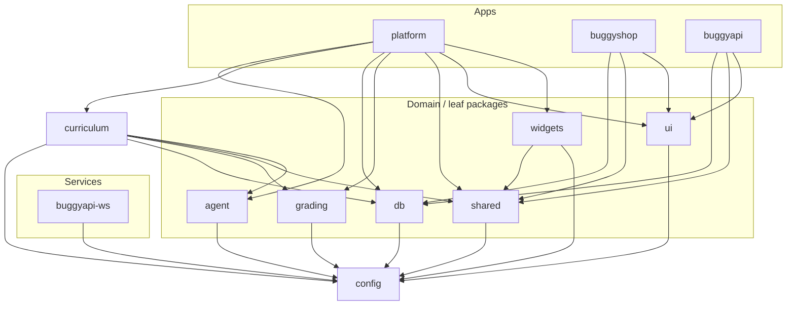

# Architecture

QA Mastery is a hands-on QA learning platform. Three Next.js apps plus one
WebSocket service share a Supabase (Postgres + Auth + Storage) backend through
a set of internal packages, deployed on Vercel (apps) and Fly.io (the WebSocket
service). This doc is the system overview; `CLAUDE.md` holds the engineering
conventions + invariants, and `DEPLOYMENT.md` the go-live steps.

## System context

- **platform** (`:3000`) — the learner-facing app: the notes wiki (the live
  curriculum content — see "Content model" below), interactive widgets, graded
  quizzes/labs/capstone, dashboard/XP, the help-agent tutor, code labs, the
  talent marketplace.
- **buggyshop** (`:3001`) — a deliberately-buggy practice e-commerce app the
  curriculum tests against. Fake (cookie-free) auth; every bug is seeded behind
  a release flag.
- **buggyapi** (`:3002`) — a second deliberately-buggy practice surface: a live
  REST + GraphQL + SOAP API ("TaskFlight") with seeded bugs gated by sandbox
  mode (`apiBugFlag`) instead of a release flag. Not yet provisioned on Vercel
  (see `docs/09-deployment.md`).
- **buggyapi-ws** (`services/buggyapi-ws`) — BuggyAPI's WebSocket practice
  surface, deployed separately to Fly.io (Vercel serverless can't hold
  sockets).
- **Supabase** — Postgres (RLS), Auth, Storage. One client per request;
  `auth.getUser()` for the real boundary; a service-role client bypasses RLS for
  server-side writes.
- **LLM** — the tutor resolves a provider free-first (Ollama → Gemini → Groq);
  paid (xAI/OpenAI) is opt-in only.

## Content model — notes wiki, not "lessons"

The live curriculum content is the **notes wiki**
(`packages/curriculum/src/notes/**`, MDX under
`packages/curriculum/content/notes/**`, ~900 topics across modules/chapters) —
pure files, no DB registry, read directly at request time. There is a separate
older **lessons** system (`packages/curriculum/src/load.ts`, a DB-registry-
backed model under `learn/`) that predates the notes wiki; this checkout has
zero actual lesson `.mdx` files, so any doc describing a specific lesson count
as "live" is describing the lessons system, not what learners actually see
today. Prefer the notes wiki when describing curriculum content.

## Package dependency graph

A strict DAG — apps/services consume packages, packages never depend on apps
or on each other cyclically, and `config` is the universal leaf. Guarded by
`scripts/check-dep-cycles.mjs` (part of `pnpm verify`), which reads this same
graph from each workspace's `package.json` rather than trusting this diagram
to stay in sync by hand.

```mermaid
graph TD
    subgraph Apps
      platform; buggyshop; buggyapi
    end
    subgraph Services
      buggyapi_ws["buggyapi-ws"]
    end
    curriculum
    subgraph "Domain / leaf packages"
      agent; db; grading; shared; ui; widgets
    end
    config

    platform --> agent & curriculum & db & grading & shared & ui & widgets
    buggyshop --> db & shared & ui
    buggyapi --> db & shared & ui
    buggyapi_ws --> config
    curriculum --> db & grading & shared & agent & config
    widgets --> shared & config
    agent & db & grading & shared & ui --> config
```

| Layer         | Packages                                                            | Role                                                              |
| ------------- | ------------------------------------------------------------------- | ----------------------------------------------------------------- |
| 3 — apps/svc  | `platform`, `buggyshop`, `buggyapi`, `buggyapi-ws`                  | Next.js App Router (apps) / Node WS server; consume packages only |
| 2 — composite | `curriculum` (MDX→registry, RAG embedding), `widgets` (teaching UI) | depend on `shared`/`db`/`grading`/`agent`                         |
| 1 — domain    | `agent` (tutor LLM), `grading`, `db`, `ui`, `shared`                | depend on `config`                                                |
| 0 — leaf      | `config` (tsconfig/eslint)                                          | nothing                                                           |

**Pattern:** modular monolith on a shared Postgres — right for a small team +
rapid iteration. Internal packages ship TS source; apps list them in
`transpilePackages`. Runtime-heavy/server-only code is fenced behind subpath
exports (`@qa-mastery/grading/runners` keeps `node:child_process` out of client
bundles).

## Data model

Postgres, `supabase/migrations/` (the migration count grows over time — see
the directory itself rather than a number here, which would only go stale).

**`public` schema — learner data.** RLS read-own; scores/XP/entitlements are
written only by the service role (invariant 2 — learners never write scores).

- Identity/content: `profiles`, `tracks`, `modules`, `lessons`, `sandboxes`
- Progress + grading: `progress`, `quiz_attempts`, `review_queue`, `xp_events`,
  `bug_reports` (+`evidence_url`), `capstone_submissions`, `entitlements`
- Notes wiki progress: `note_progress`, `note_labs`, `note_capstone`
- Code labs: `code_runs` (rate-limit counting + run ownership)
- Help agent: `help_agent_profiles` / `_messages` / `_memories`
- `audit_events` — append-only trail of sensitive ops; **RLS-on, no policies**
  (service-role only, never learner-readable)

**`buggyshop` schema — sandbox.** Deny-all RLS; all access is service-role via
route handlers, every row scoped by `sandbox_id` (invariants 3 & 4). The
seeded-bug manifest (`bs_bug_manifest`) is server-only — its internal fields
never reach a client bundle (invariant 1, CI-checked). `buggyapi` ships an
analogous `ba_bug_manifest` under the same invariant.

## Key request flows

- **Auth boundary.** `src/proxy.ts` does optimistic redirects only; the
  `(app)/layout.tsx` server check is the real gate, and every mutating server
  action re-checks (`getAuthedUserId()` or an equivalent guard — see
  `scripts/check-actions-auth.mjs`).
- **Grading.** Pure graders live in `@qa-mastery/grading` (`scoreQuiz`,
  `matchBugReport`, `gradeCapstone`, `validateCodeSubmission`) — answer keys are
  server-only; server actions persist scores via the service role.
- **Code labs.** `submitCodeLab` validates → rate-limits (per-day quota) →
  forwards to a runner → records the run; `pollCodeRun` checks run ownership
  before returning a result.
- **Tutor.** Chat route authenticates → rate-limits (DB-backed daily count) →
  builds lesson/learner context → streams via `guardedStream` (a streaming-safe
  guard that withholds any answer/manifest leak before it reaches the client) →
  persists + audit-logs.

## Deployment & CI/CD

Three Vercel projects (one per app, rooted at `apps/platform` /
`apps/buggyshop` / `apps/buggyapi` — buggyapi's isn't provisioned yet) plus one
Fly.io app (`buggyapi-ws`) build from this monorepo on a shared Supabase cloud
project. `.github/workflows/deploy.yml` triggers on CI's own completion
(`workflow_run`, not the push itself) and deploys exactly the commit CI
verified (`head_sha`) via the Vercel CLI / `flyctl`, with a post-deploy health
check per target; `ci.yml` runs the quality gates first — `checks`, `rls`, a
reusable `security` workflow, `e2e-core` (sharded 4 ways), `e2e-buggyapi`,
`e2e-first-paint`, `e2e-full` (gated to `main`/`full-e2e`-labeled PRs), a
merged Playwright report, and an aggregate `release-gate`. Vercel's own build
also gates the deploy — a red build leaves the live alias on the last good
one. The platform's `next.config.ts` traces `packages/curriculum/content` into
the serverless bundle so notes/quiz/tutor routes can read it at request time.
Full runbook, the deploy gotchas, and the design system:
[`docs/09-deployment.md`](./docs/09-deployment.md).

## Invariants

The seven invariants in `CLAUDE.md` are the load-bearing rules (manifest
secrecy, learners-never-write-scores, fake BuggyShop/BuggyAPI auth, sandbox
scoping, immutable slugs, registry-validated widgets, bug flags). They're
enforced in code (RLS + service-role writes + the streaming guard) and guarded
by the RLS regression suite, the manifest-leak CI grep, and unit tests.
