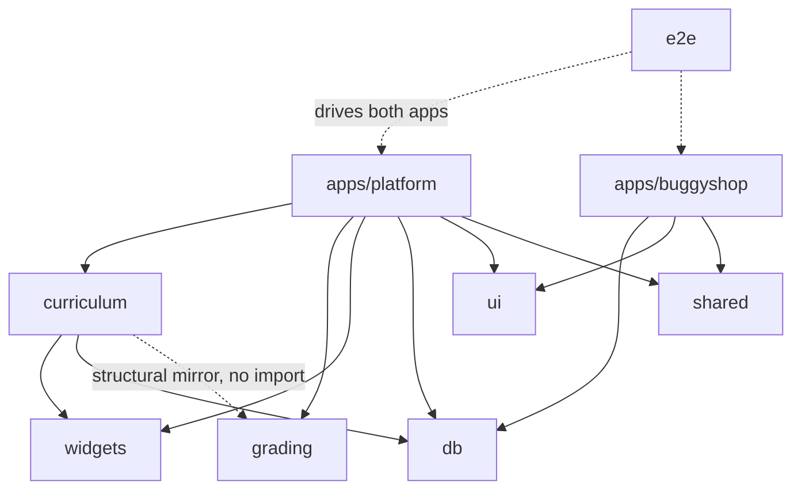

# 02 — Architecture

## Monorepo layout

```
qa-mastery/
├── apps/
│   ├── platform/      # the learning app (Next.js 16, port 3000)
│   └── buggyshop/     # the buggy practice app (Next.js 16, port 3001)
├── packages/
│   ├── curriculum/    # MDX lessons + frontmatter schema + DB sync script
│   ├── grading/       # pure scoring: quizzes, bug-report matching, runner
│   ├── widgets/       # interactive lesson widgets (Boundary Hunter, …)
│   ├── db/            # Supabase client factories (browser / server / service)
│   ├── shared/        # cross-app primitives (the sandbox handoff token)
│   ├── ui/            # design-system components (Button, Card, Badge)
│   └── config/        # shared tsconfig / tooling config
├── supabase/migrations/   # the data model (SQL)
├── e2e/               # Playwright cross-app suite (Chromium + WebKit)
└── docs/              # you are here
```

Build orchestration is **Turborepo** (`turbo.json`) over **pnpm workspaces**
(`pnpm-workspace.yaml`). Internal packages ship **TypeScript source** (no build
step) and each app lists them in `transpilePackages` so Next transpiles them
in place.

## Tech stack & why

| Choice | Why |
|---|---|
| **Next.js 16.2.9** (App Router, Turbopack, React Compiler) | Server Components let lesson content + answer keys stay server-side; server actions handle grading without a separate API. ⚠️ Middleware is `src/proxy.ts` (not `middleware.ts`) — this Next differs from older docs; check `apps/*/node_modules/next/dist/docs/` before using unfamiliar APIs. |
| **Supabase** (Postgres + Auth + RLS) | Row-Level Security *is* the authorization model. The platform's security guarantees (learners can't write scores, can't read other learners) are enforced in the database, not just the app. |
| **`@supabase/ssr`** | Cookie-based auth across Server Components / actions. Convention: always `getAll`/`setAll` cookie methods; always `auth.getUser()` (never `getSession()`) in server code; one client per request. |
| **Tailwind v4** | Styling. Workspace package sources need an `@source` line in each app's `globals.css` so their classes are scanned (see the widgets `@source` in `apps/platform/src/app/globals.css`). |
| **TS-source packages + `transpilePackages`** | No per-package build/watch; edit-and-refresh DX, single type-check graph. |
| **Turborepo + pnpm** | Cached `build`/`lint`/`typecheck`/`test`; the `e2e` script chains `turbo build` first (cached → cheap). |

## Package dependency graph



Note `curriculum` deliberately does **not** import `grading` — it re-declares a
structurally-identical `QuizQuestionFile` locally so content tooling stays free
of scoring logic.

## The three-layer auth boundary

Authentication is checked in three places, by design — the outer layers are
optimistic (fast UX), the inner layers are the real gate:

```mermaid
sequenceDiagram
  participant U as Browser
  participant P as proxy.ts (middleware)
  participant L as (app)/layout.tsx (RSC)
  participant A as server action

  U->>P: GET /learn/boundary-value-analysis
  P-->>U: optimistic redirect to /login if no session cookie
  U->>L: (authenticated) render (app) shell
  L->>L: supabase.auth.getUser() — REAL boundary; redirect if null
  U->>A: submitQuiz(slug, answers)
  A->>A: getAuthedUserId() re-checks — throws if not authed
  A-->>U: graded result
```

- **`src/proxy.ts`** — optimistic redirects only. Never the security boundary.
- **`(app)/layout.tsx`** — server-side `getUser()`; the true page-level gate.
- **Every mutating server action** — re-checks via `getAuthedUserId()`
  (`apps/platform/src/lib/auth.ts`). Defence in depth: a server action is
  reachable without rendering the layout, so it cannot trust the layout's check.

## Two apps, one identity

The platform owns the real learner identity (Supabase Auth cookies). BuggyShop
has its **own fake auth** (a curriculum subject — its login bugs are part of the
lessons) and never shares cookies with the platform. Real identity crosses into
BuggyShop only via a signed **handoff token** (`packages/shared`) delivered in a
URL fragment (`/enter#t=…`) and stored in `localStorage` — never a cookie. See
[04 — Invariants](./04-invariants.md) #3 and [08 — Decisions](./08-decisions.md).

Next: [03 — Data model](./03-data-model.md).
