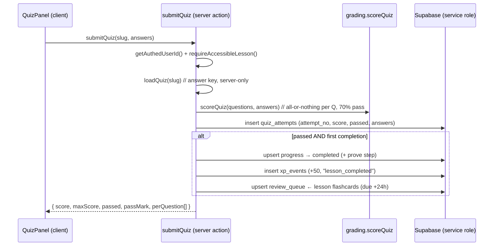

# 06 — The Learn feature

The one fully-built end-to-end vertical (M1). Route: `/learn/[slug]`, e.g.
`/learn/boundary-value-analysis`. This is the reference for how content, widgets,
grading, and progress fit together.

## Files

```
apps/platform/src/app/(app)/learn/
├── actions.ts            # server actions: saveProgress, submitQuiz, submitBugReport
└── [slug]/
    ├── page.tsx          # server component — renders the lesson
    ├── mdx-components.tsx # prose styling for the MDX body (server)
    ├── progress-context.tsx # client — fire-and-forget step tracking
    ├── see-widget.tsx    # client — the Boundary Hunter, wired to progress (See it)
    ├── lab-panel.tsx     # client — the bug-report form (Do it)
    ├── lab-widget.tsx    # client — <BugReportLab/> wrapper, slug from context
    └── quiz-panel.tsx    # client — the quiz UI + grading round-trip (Prove it)
apps/platform/src/lib/auth.ts   # getAuthedUserId() — used by the actions
```

## The "Do it" lab

The lesson MDX embeds `<BugReportLab/>` in its "Do it" section. The learner finds
the seeded bug on BuggyShop's products page, then files a structured report
(page / feature / category / severity from the *stripped* taxonomy, plus title /
steps / expected / actual). `submitBugReport` reads the seeded-bug manifest
server-side from the deny-all `buggyshop` schema for the lesson's release, grades
it with `matchBugReport`, records the submission in `bug_reports`, and marks the
"do" step. The manifest's internal title is revealed only as post-match feedback.

## The page (`page.tsx`, Server Component)

1. `await params` → `slug` (Next 16: dynamic params are a Promise).
2. `findLessonBySlug(slug)`; `notFound()` unless `status === "published"`.
3. `loadLessonBody(slug)` → MDX string (frontmatter stripped).
4. `loadQuiz(slug)` → **strip the answer key**: only `{id, type, prompt, options}`
   are passed to the client `QuizPanel`. `correct`/`explanation` stay on the server.
5. Render the body with `MDXRemote` (`next-mdx-remote/rsc`), mapping the
   `BoundarySlider` tag to the live `SeeWidget` and styling prose via
   `mdxComponents`. Wrap everything in `LessonProgressProvider`.

```tsx
<MDXRemote
  source={body}
  components={{ ...mdxComponents, BoundarySlider: SeeWidget }}
/>
```

RSC rendering is what keeps the answer key off the client: the MDX compiles on
the server, and only public quiz fields are serialized into the client island.

## Progress tracking (`progress-context.tsx`, client)

A context exposing `slug` + `markStep(step)`. It is **fire-and-forget and
low-stakes**:

- On mount, calls `saveProgress(slug)` once to ensure a `started` row.
- `markStep("see" | "try" | "do" | "prove")` is idempotent per step and calls
  `saveProgress(slug, step)`.
- **Every call swallows errors** (`.catch(() => {})`) — a failed progress write
  must never block reading the lesson or taking the quiz.

## The widget (`see-widget.tsx`, client)

Wraps `BoundarySlider` from `@qa-mastery/widgets`, binding the slug from context
and translating the widget's `found-boundary-bug` milestone into
`markStep("see")`. The widget itself (the Boundary Hunter) lets the learner walk
a "1–99" field's edges and *discover* that `0` is wrongly accepted — the same
off-by-one class as BuggyShop's BS-007.

## Server actions (`actions.ts`)

Both re-check auth via `getAuthedUserId()` and gate on a published, free,
DB-registered lesson (`requireAccessibleLesson`). Pro gating is a `TODO(M3)`.

### `saveProgress(slug, step?)`
Service-role upsert into `progress`. With a `step`, sets that key in `step_state`.
Without, just ensures a `started` row. Completion is **not** owned here.

### `submitQuiz(slug, answers)` — the graded path



The response includes, **per question**, `correctIndices` + `explanation` — the
answer key, revealed only now that grading is done. The client renders right/
wrong styling and explanations from it. XP (`XP_LESSON_COMPLETED = 50`),
completion, and flashcard seeding happen only on the *first* pass.

## The quiz UI (`quiz-panel.tsx`, client)

Single/multi-select option buttons; submit disabled until every question is
answered; on submit calls `submitQuiz`, then locks the form and shows the
pass/fail banner, per-question correctness, and explanations, with a "Try again"
reset. Errors (e.g. lesson not yet synced to the DB) surface inline.

## Answer-key secrecy — the guarantee

| Stage | What the client has |
|---|---|
| Page render | Prompts + options only. No `correct`, no `explanation`. |
| After `submitQuiz` | `correctIndices` + `explanation` for review — returned by the grader. |

Verified: a production build's `.next/static` contains none of the quiz answer
content (only the field name `correctIndices` as a property accessor in the
component, which reads the runtime response).

## Tested

`e2e/tests/learn.spec.ts` (Chromium + WebKit): anonymous → redirected to login;
signup → dashboard → open lesson → discover the widget bug → answer all six
questions correctly → submit → pass banner + explanations. The pass path
exercises the full service-role write chain.

Next: [07 — Development](./07-development.md).
